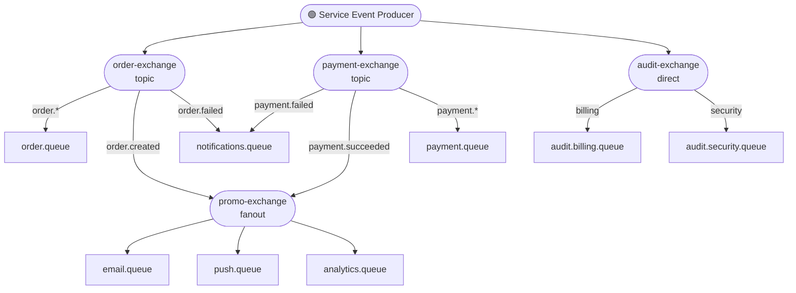

# 📊 RabbitMQ Topology example with multipe exchanges and bindings

```mermaid
flowchart TD
    %% =========================
    %% Publisher Service
    %% =========================
    PubService([🟢 Service Event Producer])

    %% =========================
    %% Order Domain
    %% =========================
    OX([order-exchange<br/>topic])
    OQue[order.queue]

    OX -->|order.*| OQue

    %% =========================
    %% Critical Notifications
    %% =========================
    NQ[notifications.queue]

    %% =========================
    %% Fanout: Promotions Example
    %% =========================
    FX([promo-exchange<br/>fanout])
    FEmail[email.queue]
    FPush[push.queue]
    FAnalytics[analytics.queue]

    FX --> FEmail
    FX --> FPush
    FX --> FAnalytics

    %% =========================
    %% Critical bindings & fanout bindings
    %% =========================
    OX --->|order.created| FX
    OX -->|order.failed| NQ
    PX -->|payment.failed| NQ
    PX --->|payment.succeeded| FX

    %% =========================
    %% Payment Domain
    %% =========================
    PX([payment-exchange<br/>topic])
    PQue[payment.queue]

    PX -->|payment.*| PQue

    %% =========================
    %% Publisher connections
    %% =========================
    PubService --> OX
    PubService --> PX
    PubService --> AX

    %% =========================
    %% Direct: Audit Example
    %% =========================
    AX([audit-exchange<br/>direct])
    ABill[audit.billing.queue]
    ASec[audit.security.queue]

    AX -->|billing| ABill
    AX -->|security| ASec
```
